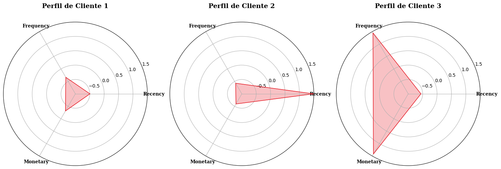
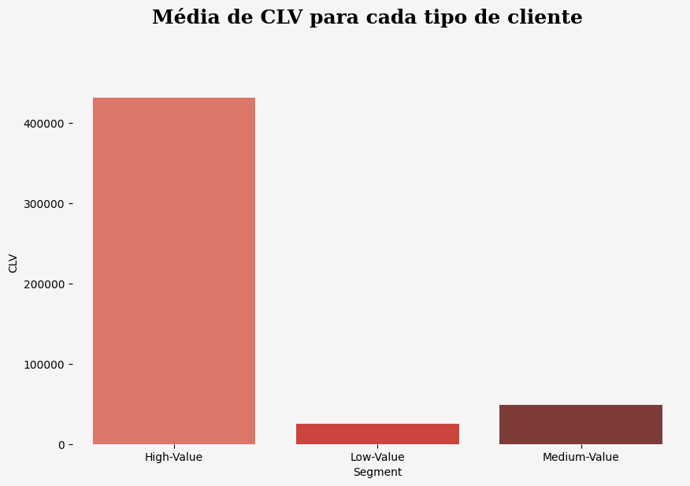
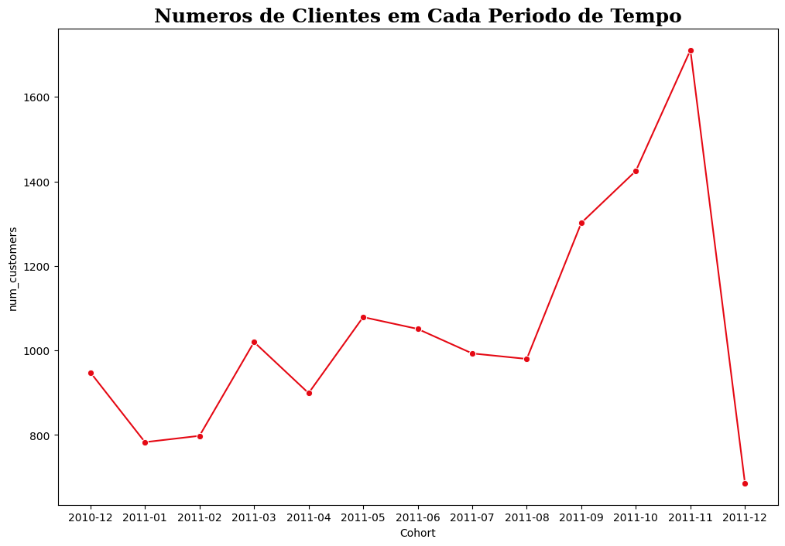

# customer-segmentation

## Introdução

 conjunto de dados abrange transações de 12/01/2010 a 12/09/2011 para uma loja online sediada no Reino Unido, especializada em presentes exclusivos. Com uma parte significativa de clientes atacadistas, o objetivo é realizar uma análise nos clientes, agrupando-os em diferentes perfis com base em seus hábitos de compra. A intenção é atribuir estratégias específicas para cada perfil, visando maximizar o lucro da empresa.

## Análise de RFM

 Para analisar e compreender os perfis dos clientes, a primeira etapa envolve o cálculo do RFM (Recency, Frequency, Monetary). Essa abordagem de marketing agrupa os clientes com base na recenticidade, frequência e valor monetário de suas transações, oferecendo uma visão mais abrangente e precisa do comportamento de compra. Ao evitar a simplificação do valor do cliente para uma única métrica, o modelo RFM possibilita uma segmentação mais refinada da base de clientes, identificando grupos propensos a responder a estratégias de marketing personalizadas. Isso resulta em uma otimização das abordagens de marketing, maximizando o valor do cliente para a empresa.

## Tipos de Clientes

 Após o pré-processamento dos dados, incluindo limpeza e normalização, aplicou-se o modelo não supervisionado KMeans com 3 clusters, determinado pelo método do cotovelo para encontrar o número ideal de clusters. O modelo revelou 3 perfis distintos de clientes:

 * Cliente Tipo 1: Refere-se a clientes inativos ou esporádicos que compram ocasionalmente, mas apresentam um valor monetário significativo em suas transações. Estratégias de reengajamento são recomendadas para este grupo. Dada a sua quantidade expressiva, esses clientes são considerados uma fonte substancial de lucro para a empresa, destacando-se como um grupo de valor mediano, e, portanto, uma prioridade.

 * Tipo de Cliente 2: Neste cluster, encontram-se clientes que realizaram compras recentes, porém infrequentes e de baixo valor monetário. Este grupo pode incluir clientes que fizeram uma única compra ou novos clientes que necessitam de incentivos para se tornarem compradores regulares. Apesar de uma quantidade moderada, este grupo gera menos lucro para a empresa, sendo identificado como um grupo de valor baixo e, consequentemente, uma prioridade menor.

 * Tipo de Cliente 3: Representa clientes leais e valiosos que realizam compras recentes, frequentes e de alto valor. Estratégias de retenção e programas de fidelidade são recomendados para manter esse grupo engajado. Apesar de serem menos numerosos, esses clientes são os maiores geradores de lucro para a empresa, destacando-se como um grupo de valor alto e, portanto, uma prioridade máxima.

## Análise de CLV

 CLV (Customer Lifetime Value) é uma métrica crucial que estima a receita total que um negócio pode esperar de um cliente ao longo de toda a relação. Ao calcular e analisar o CLV entre os tipos de clientes, fica evidente que o grupo de clientes do tipo 3 apresenta o maior CLV em comparação aos outros dois, conforme destacado na figura abaixo. Esse resultado está alinhado com a expectativa de que clientes com valores e frequências de transações mais elevados, como observado no segmento de clientes do tipo 3, tendem a contribuir mais para o negócio ao longo de sua vida. O grupo de clientes do tipo 1 indica um CLV substancial, embora inferior ao do cliente do tipo 3. Já o cliente do tipo 2 demonstra o menor CLV. Essa análise destaca a importância de focar em estratégias de retenção e valorização do cliente, especialmente para os clientes do tipo 3, a fim de maximizar o valor vitalício total da base de clientes.

 

## Análise de Coorte

 Uma "coorte" refere-se a um grupo de indivíduos com características ou experiências semelhantes durante um período específico. No contexto de análise de dados, realizou-se uma coorte mensal, analisando a quantidade de clientes, transações e lucros por mês. Diversas métricas foram plotadas, evidenciando que os períodos de fim de ano consistentemente apresentaram os maiores números de clientes, resultando em volumes de transações e lucros mais elevados. Essa observação destaca uma tendência sazonal, em que as épocas festivas atraem uma base de clientes maior, resultando em atividade comercial intensificada e ganhos financeiros significativos, como visto no gráfico abaixo.

 

## Conclusão

 A análise abrangente dos perfis de clientes iniciou-se com o cálculo do modelo RFM, segmentando-os com base na recenticidade, frequência e valor monetário das transações. Posteriormente, utilizando o modelo KMeans com 3 clusters, identificaram-se três perfis distintos. O Cliente Tipo 3, representando clientes leais e valiosos, destacou-se como o maior gerador de lucro e apresentou o maior Customer Lifetime Value (CLV). A análise de coortes mensais revelou uma tendência sazonal, com picos consistentes de clientes, transações e lucros durante os períodos de fim de ano. Isso reforça a importância estratégica desses períodos para a empresa. Em suma, as estratégias de retenção e fidelidade são cruciais, especialmente para clientes do Tipo 3, visando maximizar o valor vitalício total da base de clientes e otimizando a abordagem de marketing durante as épocas sazonais mais lucrativas

